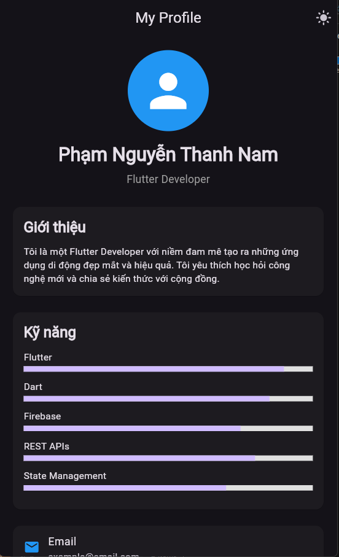
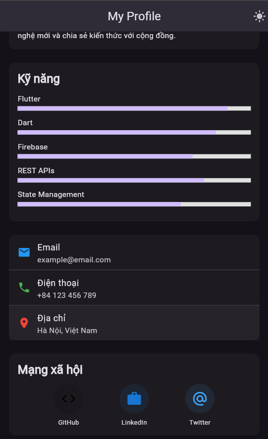



## 🗓 Tuần 7 – UI, State & Navigation cốt lõi

### 🧱 Dự án 1: Ứng dụng Hồ sơ cá nhân
**Mục tiêu:** Học layout cơ bản và UI đáp ứng (responsive).
**Mô tả:** Xây dựng một ứng dụng hiển thị thông tin cá nhân, ảnh hồ sơ, kỹ năng và các liên kết mạng xã hội của bạn.
**Yêu cầu kỹ thuật:**
* `Column`, `ListTile`, `CircleAvatar`, `Card`
* Layout đáp ứng, nút chuyển đổi chế độ tối (dark mode)
**Kết quả:** Một ứng dụng portfolio cá nhân gọn gàng, đáp ứng.

  
  

---

### 📚 Dự án 2: Ứng dụng Todo (Local State)
**Mục tiêu:** Quản lý danh sách công việc đơn giản bằng state cục bộ.
**Mô tả:** Thêm, hoàn thành và xóa công việc với lưu trữ cục bộ.
**Yêu cầu kỹ thuật:**
* `StatefulWidget`, `ListView.builder()`
* `setState()` để quản lý state
**Kết quả:** Ứng dụng danh sách việc cần làm có khả năng hoạt động ngoại tuyến.

---

### 🧭 Dự án 3: Ứng dụng Đọc tin tức
**Mục tiêu:** Làm việc với REST APIs.
**Mô tả:** Lấy tin tức từ NewsAPI.org, hiển thị các bài báo và mở chi tiết.
**Yêu cầu kỹ thuật:**
* `http`, `FutureBuilder`
* Xử lý lỗi và chỉ báo tải (loading indicators)
**Kết quả:** Ứng dụng đọc tin tức dựa trên API thời gian thực.

---

### 💬 Dự án 4: Clone Giao diện Chat
**Mục tiêu:** Tạo các layout phức tạp với cuộn (scrolling).
**Mô tả:** Thiết kế giao diện chat tương tự như Messenger hoặc WhatsApp.
**Yêu cầu kỹ thuật:**
* `ListView`, `Row`, `Column`, `Container`
* Giao diện bong bóng tin nhắn động
**Kết quả:** Giao diện chat mô phỏng (mock) hoạt động.

---

### 🎨 Dự án 5: Ứng dụng Ghi chú (Provider State)
**Mục tiêu:** Quản lý state toàn ứng dụng bằng Provider.
**Mô tả:** Tạo, chỉnh sửa và xóa ghi chú trong thời gian thực.
**Yêu cầu kỹ thuật:**
* `Provider`, `ChangeNotifier`
* `TextField`, `FloatingActionButton`
**Kết quả:** Ứng dụng ghi chú đáp ứng với cập nhật trực tiếp.

---

## 🗓 Tuần 8 – Networking, Persistence & Integration

### 🌦 Dự án 6: Ứng dụng Thời tiết
**Mục tiêu:** Lấy và hiển thị dữ liệu thời tiết trực tiếp.
**Mô tả:** Hiển thị thời tiết dựa trên vị trí địa lý của người dùng.
**Yêu cầu kỹ thuật:**
* `geolocator`, `http`
* `FutureBuilder`, phân tích JSON
**Kết quả:** Ứng dụng dự báo thời tiết thời gian thực.

---

### 💾 Dự án 7: Ứng dụng Theo dõi chi tiêu (Lưu trữ cục bộ)
**Mục tiêu:** Lưu và trực quan hóa dữ liệu cục bộ.
**Mô tả:** Ghi lại chi tiêu hàng ngày, xem biểu đồ tóm tắt.
**Yêu cầu kỹ thuật:**
* `Hive` hoặc `sqflite`
* `fl_chart` cho biểu đồ
**Kết quả:** Ứng dụng quản lý chi tiêu ngoại tuyến với thống kê.

---

### 📸 Dự án 8: Ứng dụng Thư viện ảnh
**Mục tiêu:** Tích hợp các tính năng gốc của thiết bị.
**Mô tả:** Chụp ảnh và hiển thị chúng trong chế độ xem thư viện.
**Yêu cầu kỹ thuật:**
* `image_picker`, `permission_handler`
* `GridView`, tùy chọn lưu trữ cục bộ
**Kết quả:** Ứng dụng thư viện ảnh đơn giản.

---

### 🔔 Dự án 9: Ứng dụng Nhắc nhở (Thông báo)
**Mục tiêu:** Làm việc với thông báo cục bộ.
**Mô tả:** Lên lịch nhắc nhở với tiêu đề và thời gian tùy chỉnh.
**Yêu cầu kỹ thuật:**
* `flutter_local_notifications`
* `DateTimePicker`, trình kích hoạt nền không đồng bộ (async)
**Kết quả:** Ứng dụng nhắc nhở hoạt động với thông báo.

---

### ☁️ Dự án 10: Ứng dụng Đăng nhập Firebase
**Mục tiêu:** Tích hợp Firebase Authentication.
**Mô tả:** Đăng nhập/đăng ký bằng email & mật khẩu và hiển thị thông tin người dùng.
**Yêu cầu kỹ thuật:**
* `firebase_core`, `firebase_auth`
* `StreamBuilder` cho trạng thái xác thực (auth state)
**Kết quả:** Ứng dụng đăng nhập dựa trên Firebase.
